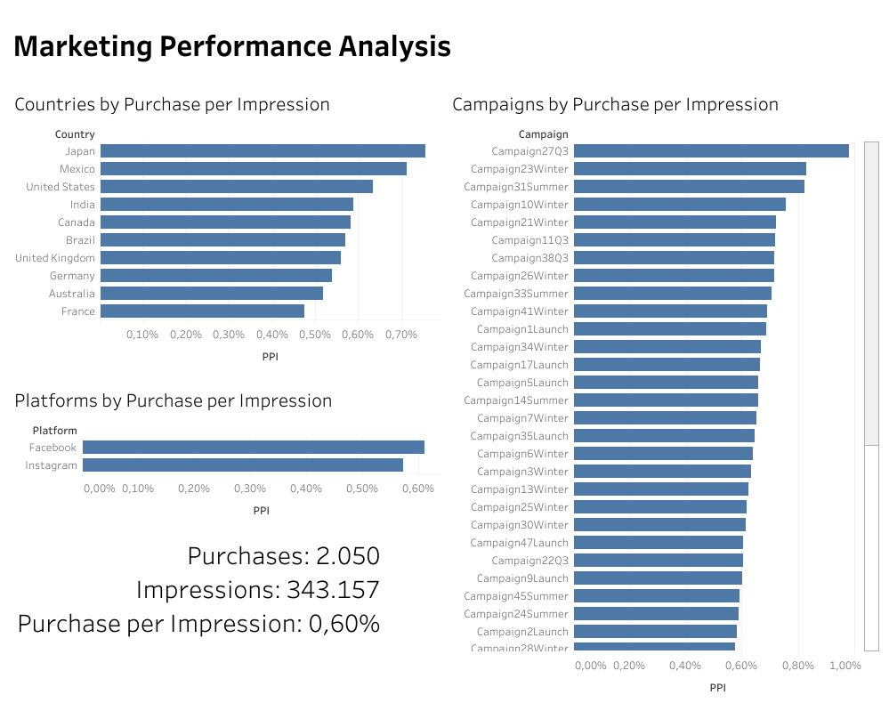

# Marketing Campaign Analysis

## Overview
This project analyzes marketing campaign performance using transactional and campaign level data. The objective is to evaluate how different marketing campaigns perform across regions and countries, supporting data driven decision making in marketing contexts.

## Business Problem
Marketing teams invest in multiple campaigns targeting different regions and markets, but campaign performance can vary significantly by country and audience. Understanding which campaigns generate stronger engagement and revenue related outcomes across regions is essential for optimizing marketing strategies and allocating resources more effectively. This analysis focuses on assessing campaign performance and identifying patterns that differentiate higher and lower performing campaigns at a regional level.

## Dataset
Public marketing campaign dataset containing customer, transaction, campaign, and geographic information, enabling analysis of campaign performance across countries.

**Datasource:**  
[Social Media Advertisement Performance Dataset (Kaggle)](https://www.kaggle.com/datasets/alperenmyung/social-media-advertisement-performance)

## Analytical Workflow
- Loaded and validated marketing and transaction data using SQL
- Built analytical queries to evaluate campaign performance metrics
- Analyzed campaign outcomes across different countries and regions
- Compared engagement and revenue related patterns across campaigns
- Translated analytical results into clear marketing insights

## Dashboard

The dashboard provides an overview of marketing campaign performance across countries and platforms. It highlights regional differences and platform level variations in campaign outcomes, allowing for comparison of engagement and performance patterns across markets and distribution channels. The dashboard complements the analysis by offering a clear visual perspective on how campaigns perform by country and platform.

## Key Insights
- Campaign performance varies significantly across countries
- Certain campaigns show stronger engagement patterns in specific regions
- Regional analysis provides valuable context for campaign optimization and targeting

## Tools and Technologies
- **SQL**
